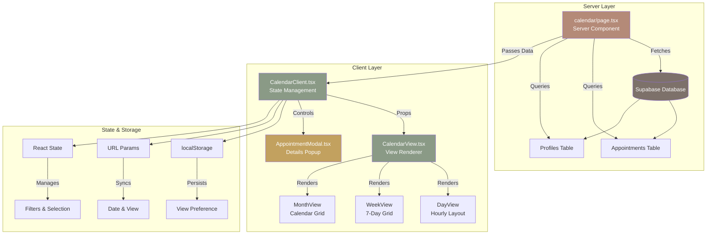

## Component Architecture

### Data Flow

```
┌─────────────────────────────────────────────────────────────┐
│  Server Component (page.tsx)                                 │
│  ─────────────────────────────────────────────────────────  │
│  1. Auth check (redirect if not logged in)                  │
│  2. Fetch user profile (role, timezone)                     │
│  3. Calculate date range (based on view)                    │
│  4. Query appointments (RLS-filtered)                       │
│  5. Query providers (for filtering)                         │
│  6. Format data for client                                  │
└─────────────────────────────────────────────────────────────┘
                            ↓
┌─────────────────────────────────────────────────────────────┐
│  Client Component (CalendarClient.tsx)                       │
│  ─────────────────────────────────────────────────────────  │
│  State:                                                      │
│  • view: 'day' | 'week' | 'month'                          │
│  • currentDate: string (YYYY-MM-DD)                        │
│  • selectedAppointment: Appointment | null                 │
│  • selectedProviders: string[]                             │
│                                                             │
│  Handlers:                                                  │
│  • handleViewChange() → update localStorage & state        │
│  • handleDateChange() → update URL & state                 │
│  • handleAppointmentClick() → open modal                   │
│  • handleSlotClick() → navigate to booking                 │
│  • handleProviderFilterChange() → update filter            │
└─────────────────────────────────────────────────────────────┘
                            ↓
┌─────────────────────────────────────────────────────────────┐
│  View Component (CalendarView.tsx)                          │
│  ─────────────────────────────────────────────────────────  │
│  • Controls (view toggle, filters, navigation)             │
│  • Conditionally renders:                                   │
│    - DayView (hourly slots)                                │
│    - WeekView (7-day grid)                                 │
│    - MonthView (calendar grid)                             │
│  • Applies provider filtering                              │
│  • Generates color coding                                  │
│  • Summary footer                                          │
└─────────────────────────────────────────────────────────────┘
                            ↓
┌─────────────────────────────────────────────────────────────┐
│  Modal Component (AppointmentModal.tsx)                     │
│  ─────────────────────────────────────────────────────────  │
│  • Displays when appointment selected                       │
│  • Full appointment details                                │
│  • Action buttons (complete, reschedule, cancel, note)     │
│  • Keyboard support (ESC to close)                         │
│  • Click-outside to close                                  │
└─────────────────────────────────────────────────────────────┘
```

## File Structure

```
src/
├── app/
│   └── dashboard/
│       └── calendar/
│           └── page.tsx ← Server Component (entry point)
│
└── components/
    └── shared/
        ├── CalendarClient.tsx ← State management wrapper
        ├── CalendarView.tsx ← View rendering logic
        │   ├── DayView component
        │   ├── WeekView component
        │   └── MonthView component
        └── AppointmentModal.tsx ← Details popup
```

## State Management

```
┌────────────────────────────────────────────────────────────┐
│  Persistent State (survives reload)                        │
├────────────────────────────────────────────────────────────┤
│  localStorage                                              │
│  • 'calendar-view' → 'day' | 'week' | 'month'            │
│                                                            │
│  URL Parameters                                           │
│  • ?from=YYYY-MM-DD → current start date                 │
│  • ?view=day|week|month → current view mode              │
└────────────────────────────────────────────────────────────┘

┌────────────────────────────────────────────────────────────┐
│  Transient State (resets on reload)                       │
├────────────────────────────────────────────────────────────┤
│  React State                                               │
│  • selectedAppointment → opened modal                     │
│  • selectedProviders → filter selection                   │
│  • showFilters → filter panel visibility                  │
└────────────────────────────────────────────────────────────┘
```

## Provider Color Mapping

```typescript
const PROVIDER_COLORS = [
  'bg-[var(--series-1)]/20 border-l-[var(--series-1)]',  // Rust
  'bg-[var(--series-2)]/20 border-l-[var(--series-2)]',  // Blue
  'bg-[var(--color-clay)]/20 border-l-[var(--color-clay)]',  // Rose
  'bg-[var(--color-sage)]/20 border-l-[var(--color-sage)]',  // Sage
  'bg-[var(--color-gold)]/20 border-l-[var(--color-gold)]',  // Gold
]

// Deterministic mapping: same provider = same color always
function getProviderColor(providerId: string, providers: Provider[]): string {
  const index = providers.findIndex(p => p.id === providerId)
  return PROVIDER_COLORS[index % PROVIDER_COLORS.length]
}
```

## Date Range Calculation

```typescript
// Day View: Just the selected day
startKey = '2026-08-01'
endKey = '2026-08-02'  // +1 day

// Week View: 7 consecutive days
startKey = '2026-08-01'
endKey = '2026-08-08'  // +7 days

// Month View: Entire month + padding
startKey = '2026-08-01'  // First of month
endKey = '2026-09-08'    // First of next month + 7 days
```

## Query Optimization

```sql
-- Server-side query structure
SELECT 
  appointments.*,
  client:profiles!appointments_client_id_fkey(...),
  provider:profiles!appointments_provider_id_fkey(...),
  appointment_services(...)
FROM appointments
WHERE 
  starts_at >= [startKey at 00:00 in timezone]
  AND starts_at < [endKey at 00:00 in timezone]
  AND status != 'cancelled'
  AND (provider_id = [user.id] OR [isFrontDesk])  -- RLS
ORDER BY starts_at
```

## Interaction Flows

### View Appointment Details
```
User clicks appointment card
    ↓
CalendarView onClick handler
    ↓
CalendarClient.handleAppointmentClick()
    ↓
setSelectedAppointment(appointment)
    ↓
AppointmentModal renders
    ↓
User sees full details + actions
```

### Filter by Provider
```
User clicks Filters button
    ↓
CalendarView toggles showFilters
    ↓
User clicks provider chip
    ↓
CalendarView.toggleProvider()
    ↓
CalendarClient.onProviderFilterChange()
    ↓
setSelectedProviders(newList)
    ↓
useMemo recalculates filteredAppointments
    ↓
View re-renders with filtered data
```

### Change View Mode
```
User clicks Day/Week/Month button
    ↓
CalendarView calls onViewChange
    ↓
CalendarClient.handleViewChange()
    ↓
localStorage.setItem('calendar-view', view)
    ↓
setView(newView)
    ↓
CalendarView conditionally renders new view
```

### Navigate Dates
```
User clicks Prev/Next/Today
    ↓
CalendarView calculates new date
    ↓
CalendarClient.handleDateChange()
    ↓
Update URL params
    ↓
router.push() with new ?from= param
    ↓
Server Component re-runs
    ↓
New data fetched for new date range
```

## Error Handling

```typescript
// Server Component
if (!user) redirect('/login')  // Auth guard

const { data: appointments } = await query
// ↓
// appointments could be null → use || [] for safety

// Client Component
const filteredAppointments = React.useMemo(() => {
  if (selectedProviders.length === 0) return appointments
  return appointments.filter(...)
}, [appointments, selectedProviders])
// ↓
// Always returns array, never crashes on null
```

## Timezone Safety

```typescript
// All conversions go through src/lib/time.ts
import {
  dateKeyInTimeZone,      // instant → 'YYYY-MM-DD' in zone
  zonedTimeToUtc,         // wall time → absolute instant
  formatTimeInTimeZone,   // instant → '9:00 AM' in zone
  addDaysToDateKey,       // date arithmetic
} from '@/lib/time'

// NEVER:
// • setHours() / setDate()
// • toISOString().split('T')[0]
// • new Date(dateString)  (ambiguous!)
```
